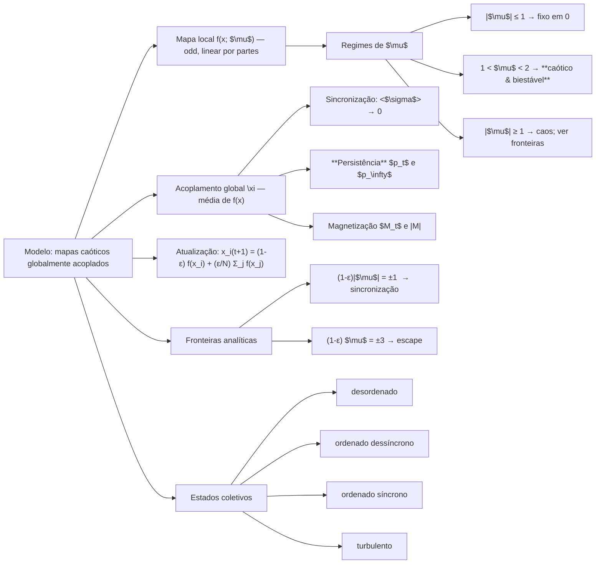

# Fundamentos, Modelo e Objetivo

> **Base principal**: Alvarez‑Llamoza & Cosenza (2014) — *Synchronization and phase ordering in globally coupled chaotic maps*.
>
> Este .md constrói um **mapa mental** do artigo (teoria completa, de leve a profundo) e um **mapa técnico** para implementar o núcleo do projeto e **reproduzir as figuras‑chave**. 
>
>Tudo costurado por uma **analogia midiática** que evolui junto com os conceitos. Quando fizer sentido, trago também uma analogia física.
>
> Artigo: [arXiv:1402.4870](https://arxiv.org/pdf/1402.4870)

---

## 1. Interação Global

Diferente do Ising local (troca de spin afetada apenas pelos primeiros vizinhos), na interação global todo mundo é afetado por todos os outros.

Pense como analogia o seguinte: No modelo de ising cada pessoa tem sua opinião baseada na opinião de seus vizinhos, enquanto na
interação global todos **escutam o mesmo "noticiário"** e tomam suas opiniões baseadas nele:um **campo médio global**. 
Queremos ver como isso altera:

* **Sincronização** (todo mundo exibindo a mesma “opinião/imagem” ao mesmo tempo),
* **Competição de Fases** (qual lado ganha quando existem duas “opiniões/canais” estáveis),
* **Caoticidade × estabilidade** (dinâmica local explosiva vs. amortecimento coletivo),
* e os regimes “no meio do caminho”.

Usaremos **mapas caóticos biestáveis**: cada unidade (i) possui **dois atratores** simétricos, e o acoplamento global decide 
se a população congela num lado, no outro ou se entra em um regime turbulento. 

> **Pergunta importante para o futuro** — *Onde aparece a transição de 1ª ordem. Ela veem “da biestabilidade” ou “da variação descontínua em $\varepsilon$”?*
>
> **Resposta curta**: a **biestabilidade local fornece o palco** (duas fases possíveis), **o controle global ε puxa a alavanca**. Ao atravessar ε₁, o campo médio ganha força 
> o suficiente para **basculhar coletivamente** a maioria para um dos atratores, produzindo um **salto** em grandezas macroscópicas
> (magnetização $\langle M\rangle$), típico de transições de **1ª ordem**.
> Sem biestabilidade não haveria duas “opiniões estáveis” para competir; sem $\epsilon$ variando não surgiria o gatilho coletivo.

### Analogia da televisão/opiniões (I):

Pense em **lares** (unidades) assistindo TV. Cada casa tem um **decodificador**, pessoas que alternam entre dois canais preferidos,
(o mapa local) que é naturalmente instável, e fica **zapeando caoticamente** entre dois canais preferidos 
(os dois atratores - que dividem também em duas opiniões distintas)). 
O **sinal nacional** (campo médio) é a manchete do dia que todos recebem (opinião média compartilhada pelos lares). 
O **controle deslizante $\varepsilon$ ** regula o **peso da manchete** sobre a decisão de cada casa de seguir um canal/opinião: 
com $|\varepsilon|$ baixo, cada um segue sua própria cabeça; com $|\varepsilon|$ moderado, a manchete consegue 
**unificar a audiência**; com $|\varepsilon|$ exagerado, a interferência vira **ruído coletivo** (turbulento).

---

## 2. Contexto e Motivação

**Perda de relevância espacial**: em acoplamento global, a geometria da rede não manda — **só o tempo** importa. 
Em redes **locais**, a ordenação de fase lembra Ising: **domínios** crescem pela **curvatura de interfaces**.
Em acoplamento **global**, não há vizinhança: a ordenação (ou a falta dela) vem de uma **pressão do campo médio**. 
Isso muda tudo: **persistência satura**, transições podem ficar **descontínuas**, e a sincronização pode acontecer **com** ou **sem** ordenação.

O que isso significa: Todos podem seguir a mesma alternância de canais, mesmo sem ficar em apenas um deles.

### Metáfora vizinhos × mídia

* **Vizinhos (Ising local)**: você olha para o **quarteirão**; opiniões mudam pela **fronteira** entre bairros, que se move lentamente.
* **Mídia (campo global)**: você olha para o **Jornal Nacional**; não há fronteira espacial, só um **empurrão coletivo** que pode congelar opiniões cedo.

> **Analogia física**: campo médio lembra o **modelo de Curie‑Weiss** (Ising de todos‑com‑todos). 
> A diferença aqui é que o “átomo” é **caótico**, e os “spins” derivam do **sinal do estado** (sign(x)).

---

## 3. Modelagem

Consideramos **N** mapas acoplados globalmente:

$$\boxed{x_i^{t+1} = (1-\varepsilon)f(x_i^{t}) + \frac{\varepsilon}{N}\sum_{j=1}^{N} f(x_j^{t}),\quad i=1,\dots,N}$$

com o mapa por partes **ímpar**:

$$f(x;\mu) = \begin{cases}
-\tfrac{2\mu}{3} - \mu x, & x\in[-1,-\tfrac{1}{3}] \\
\mu x, & x\in[-\tfrac{1}{3},\tfrac{1}{3}] \\
\tfrac{2\mu}{3} - \mu x, & x\in[\tfrac{1}{3},1].
\end{cases}$$

**Legenda das variáveis**

* $x_i^t$: estado da casa *i* no tempo *t* (com x $\in [-1,1]$ enquanto não há *escape*).
* $\varepsilon $: força do **acoplamento global** (peso da manchete nacional).
* $\frac{1}{N}\sum_j f(x_j^t)$: **campo médio** (*headline* agregada).
* $\mu\in[-3,3]$: “**ganho**” do decodificador local (quão reativo/volátil é cada casa ao próprio conteúdo).

### Fases locais conforme $\mu$

* **$|\mu|\le 1$**: ponto fixo estável em 0. (TV sem contraste: qualquer imagem desbota para cinza).
* **$1<|\mu|<2$**: **caos biestável** — dois atratores caóticos simétricos **I₊, I₋** separados por um **gap** em torno de 0: $I_\pm=[\pm\mu(2-\mu)/3,\pm\mu/3]$.
* **$|\mu|=3$**: caso Miller‑Huse (clássico para ordenação com mapa caótico).
* **$|\mu|>3$**: a dinâmica sem acoplamento já tenta sair de x $\in [-1,1]$ (ver *escape* abaixo).

> **De onde vem o caos?** As derivadas por ramo são $\pm\mu$. Para $|\mu|>1$, há **expansão** (módulo da derivada > 1, $x^{t+1}$ cresce) 
> combinada com **“quebra”** nas junções (dois canais na TV). O resultado é mistura → **caos**. Quando $1<|\mu|<2$, 
> a simetria ímpar cria **dois bolsões caóticos** separados — os “dois canais preferidos”.

### Região de escape

O intervalo $[-1,1]$ é **invariante** enquanto $|(1-\varepsilon)\mu|<3$. 
Se $|(1-\varepsilon)\mu|>3$, o sistema **escapa** e diverge (sai da tela). As **fronteiras de escape** são $(1-\varepsilon)\mu=\pm 3$. [Como mostrar isso matematicamente]

### Analogia da televisão (II):

* $\mu$ é o **ganho** do circuito: alto ganho → qualquer ruído vira **zapping nervoso**.
* $\varepsilon$ é o **controle de autoridade** da manchete: aumenta e as casas **seguem** mais o noticiário.
* *Escape* é quando o televisor **perde o sinal** e a imagem sai completamente da faixa.

---

## 4. Sincronização — parâmetros, fronteiras e leituras

### Forma vetorial e autovalores

Definimos $\mathbf{x}^{t}=(x_1^t,\dots,x_N^t)$ e $\mathbf{M}$ a matriz de uns. Então

$$\mathbf{x}^{t+1}=\big[(1-\varepsilon)\mathbf{I}+\tfrac{\varepsilon}{N}\mathbf{M}\big] f(\mathbf{x}^t)$$

A matriz $\mathbf{M}$ tem dois autovalores: **$m_k$=N** (modo **homogêneo**) e **0** (degenerado (N-1) vezes, modos **transversos**), pois
todos eles são perpendiculares ao modo homogêneo $m_k=N$.

**Definição de estado sincronizado**: $x_i^t=x_j^t;\forall i,j$. 
O modo homogêneo descreve a **trajetória comum**; os transversos medem **descolamentos entre casas**.

### Estabilidade: por que os transversos mandam?

Pense que vamos escrever $f(x^{t})$ na base de autovetores de $m$ e vamos analises uma combinação de modo transversos específico $x_t$:

Linearizando um modo transverso $\delta x_t$:

$\delta x_{t+1}=(1-\varepsilon)f'(x_t)\delta x_t.$

Média exponencial → A  condição de estabilidade (sincronização) deve ser tal que $\delta x_{t+1} / \delta x_t <1$ [Explicar o motivo...diferentes rotas levando
ao mesmo x final?] :

$$\boxed{|(1-\varepsilon)e^{\lambda}|<1},\quad \lambda\equiv\text{expoente de Lyapunov do mapa local.}$$

Para o nosso mapa por partes, $f'\equiv\pm\mu$ quase sempre no atrator, então **$\lambda=\ln|\mu|$** e a fronteira vira

$$\boxed{(1-\varepsilon)|\mu|<1}.$$

**Dinâmica ao longo do modo homogêneo** m=(N) não muda com $\varepsilon$ porque $(1-\varepsilon)+\varepsilon=1$ ⇒ sobre a variedade sincronizada todos seguem 
**o mesmo mapa local**. No mapa homogêneo, a dinâmica não depende de $\varepsilon$. Assim se $|\mu|\le 1$ temos sincronização estacionária;
para $|\mu| > 1$ podemos ter sincronização caótica. Desse modo a reta $|\mu|=1$ **separa sincronização estacionária da caótica**
(Estabelecido pelo modo homogêno), enquanto os modos transversos vão separar a sincronia da não-sincronia.

> **Leitura física**: o termo $(1-\varepsilon)$ amortece diferenças entre casas. 
> Se o ganho local $|\mu|$ expande muito, precisamos de **$\varepsilon$ maior** para “colar” a imagem em todas as telas.

### Medida numérica de sincronização

Em um tempo fixo, podemos calcular o desvio‑padrão instantâneo $\sigma_t$ entre os $x_i^t$. 
Definimos $\langle\sigma\rangle$ como a média temporal pós‑transiente. Critério prático: $\langle\sigma\rangle<10^{-7}$ ⇒ sincronizado.

### Mapa de regimes (qualitativo)

* **Sincronização estacionária** $(|\mu|\le 1)$.
* **Sincronização caótica** $|\mu|>1$ e $(1-\varepsilon)|\mu|<1)$.
* **Turbulento/desordenado** (fora da estabilidade transversal) - Entre caótico e escape.
* **Escape** $((1-\varepsilon)\mu=\pm 3)$.

### Analogia da televisão (III):

* **Sincronizar** = todas as casas exibem **o mesmo programa**, quadro a quadro.
* O **amortecimento (1−$\varepsilon$)** é como ligar um **modo “anti‑fantasma”** que suprime interferências entre TVs.

---

## 5. Fases coletivas e competição de fases

Quando $1<\mu<2$, há **duas fases** naturais, associadas aos intervalos atratores $I_+$ e $I_-$. 
Introduzimos a variável de **spin** $s_i^t=\operatorname{sign}(x_i^t)\in {+1,-1}$.

**Observáveis centrais**

* **Persistência** $p_t$: fração de partículas cujo **spin nunca mudou** até o tempo *t*.
* **Magnetização** $M_t=\tfrac{1}{N}\sum_i s_i^t$; parâmetro de ordem $\langle M\rangle=|\text{média temporal de }M_t|$.
* **Desalinhamento** $\langle\sigma\rangle$: média temporal do desvio‑padrão dos $x_i$ (zero = sincronizado).

**Como variam com $\varepsilon$** (esboço determinístico que iremos reproduzir por simulação):

* **$\varepsilon$ <$\varepsilon_1$**: **não ordenado** — dois grupos estáveis em $I_\pm$, tipicamente $\langle M\rangle=0$. 
A persistência **satura** (muita gente nunca troca) → $p_\infty\in{1;0{,}5}$ dependendo da preparação.
* **$\varepsilon_1$ < $\varepsilon$ < $\varepsilon_3$**: **ordenado** $(\langle M\rangle=1)$, mas em **três realizações** distintas, 
discerníveis por $p_\infty$ e $\langle\sigma\rangle$:

  1. **Ordenado dessíncrono**: $\langle\sigma\rangle>0$, $p_\infty=0{,}5$ (metade precisou trocar de canal para seguir a maioria).
  2. **Ordenado síncrono (I)**: $\langle\sigma\rangle=0$, $p_\infty=0{,}5$.
  3. **Ordenado síncrono (II)**: $\langle\sigma\rangle=0$, **$p_\infty=0$** (todos trocaram de canal ao menos uma vez antes de sincronizar).
* **$\varepsilon$ > $\varepsilon_3$**: **turbulento** — $\langle M\rangle\to 0$, $p_\infty=0$, $\langle\sigma\rangle>0$.

> **Televisão (IV)**: $p_\infty$ é a **métrica de “lealdade de canal”**; $\langle M\rangle$ é a **audiência consolidada**; $\langle\sigma\rangle$
> é o **fantasma de imagem** (diferenças entre telas). A janela $\varepsilon_1$<$\varepsilon$<$\varepsilon_3$ é quando a manchete **convence** mas ainda não **satura** a dinâmica.

**Condições iniciais assimétricas**: se uma fração inicial $N_1/N$ já está em $I_+$ (maioria), a dinâmica tende a 
**herdar o sinal** dessa maioria. A persistência de saturação aproxima‑se de $p_\infty\approx N_1/N$: quem começou com o canal “certo” raramente troca.

---

## 6. Demonstrações essenciais (rápidas e úteis)

1. **Expoente de Lyapunov do mapa por partes**: em cada ramo $|f'|=|\mu|$. No atrator caótico simétrico, a órbita 
visita ramos de maneira ergódica com derivada em módulo constante → $\lambda=\ln|\mu|$.

2. **Estabilidade transversal**: $\delta x_{t+1}=(1-\varepsilon)f'(x_t)\delta x_t$. 
Tomando log‑média no tempo: $\langle\ln|\delta x_{t+1}|-\ln|\delta x_t|\rangle=\ln|1-\varepsilon|+\lambda<0$ ⇒ $(1-\varepsilon)e^{\lambda}<1$.

3. **Escape**: pedir que $f([-1,1])\subseteq[-1,1]$ sob o fator $(1-\varepsilon)$ dá $|(1-\varepsilon)\mu|<3$. As igualdades definem as **bordas**.

---

## 7. Intuições finas 

* **Ordenar não é o mesmo que sincronizar**: dá para ter toda a audiência no **mesmo canal** $\langle M\rangle=1$ mas com **atrasos/defasagens** entre casas $(\langle\sigma\rangle>0)$. 
Analogamente, em física da matéria condensada, ordem magnética **não** implica necessariamente **fase** temporizada em osciladores.
Sincroniza tem a ver com todos seguirem o mesmo mapa quando o tempo é levado a infinito
* **Por que a persistência satura com acoplamento global?** Porque a “decisão” não depende de bordas entre vizinhos (que moveriam aos poucos), mas sim de uma **força centralizada**; cedo cada casa “decide” se troca ou não — e depois **não há motivo** para des‑trocar.
* **Majoritarismo inicial**: com assimetria inicial, o campo médio reforça a **maioria** (curva de feedback positivo). Em termos de TV: um canal que já começa liderando tende a **consolidar** audiência quando a manchete pesa (ε moderado).

### Apêndice — detalhes que economizam depuração

* **Cálculo de $I_\pm$**: $I_\pm=[\pm\mu(2-\mu)/3;\pm\mu/3]$ para $1<\mu<2$. 
Úteis para inicialização e para checar convergência de histogramas.
* **Estimando $\varepsilon_1, \varepsilon_2$**: fazer varreduras finas em $\varepsilon$ e procure **saltos** em $\langle M\rangle$ e **patamares** em 
$p_\infty$. Marque também onde $\langle\sigma\rangle\to 0$ (síncrono) vs. (>0) (dessíncrono).
* **Sementes e reprodutibilidade**: fixe `np.random.seed` e logue condições iniciais (frações por atrator).

---

## Mapa mental (visão geral)

---

## Quantidades coletivas (observáveis)

* **Desvio‑padrão instantâneo**:
  $\sigma_t = \big[\tfrac{1}{N}\sum_i (x_i^t - \bar x_t)^2\big]^{1/2}$, $\bar x_t = \tfrac{1}{N}\sum_i x_i^t$.
  **Critério de sincronização**: $\langle\sigma\rangle$ (média temporal assintótica) $\approx 0$ (No código com tolerância numérica pequena).
* **Spins**: $s_i^t = \operatorname{sign}(x_i^t)\in{-1,+1}$.
  **Persistência**: $p_t$ = fração de mapas cujo **sinal não mudou** desde t=0. O valor de saturação $p_\infty$ **depende de $\varepsilon$** e distingue realizações do estado ordenado.
* **Magnetização**: $M_t = \tfrac{1}{N}\sum_i s_i^t$; usamos $|\langle M\rangle|$ como parâmetro de ordem (assintótico, após descartar transientes).

**Cenários típicos feitos no artigo $\mu \approx 1.9$:**

* $\varepsilon < \varepsilon_1$: fase **não ordenada**, $|\langle M\rangle|=0$, $p_\infty \approx 1$ (spins congelam nas bacias iniciais).
* $\varepsilon_1 < \varepsilon < 1$: **ordenado dessíncrono**, $|\langle M\rangle|=1$, $\langle\sigma\rangle>0$, $p_\infty\approx 0.5$.
* $1 < \varepsilon < \varepsilon_{\text{sync,sup}}$: **ordenado síncrono**, $|\langle M\rangle|=1$, $\langle\sigma\rangle\approx 0$, $p_\infty\approx 0.5$.
* $\varepsilon > 1$ e $|\mu|$ grande: transição descontínua p/ **turbulento** (no artigo, marca‑se um salto adicional e $|\langle M\rangle|\to 0$ em faixa).

> Observação: valores críticos exatos dependem de $\mu$; usaremos $\mu=1.9$ para reproduzir as figuras do artigo.

---

## Plano de reprodução (Semana 1)

**Alvo imediato:** reconstituir as **fronteiras de sincronização e de escape** (Fig. 1), validar $\langle\sigma\rangle$ e preparar o terreno para **persistência** e **magnetização** (Semanas 2–3).

Parâmetros padrão p/ testes rápidos:

* $N\in[10^3,10^4]$ (computacionalmente leve; o paper usou $10^5$).
* $\mu=1.9$; $\varepsilon$ em malha fina englobando as fronteiras analíticas.
* **ICs (bistáveis)**: metade dos mapas com amostras uniformes em $I_+$, metade em $I_-$, com sinais misturados aleatoriamente.
* Transientes: descartar $T_{\text{burn}}$ (e.g., 10^3–10^4), depois medir $\langle\sigma\rangle$.

Ideias para reproduzir de figuras

Figuras de $x_i(t)$ que mostrem o caos.
 
* **Figura 1** (mapa de regimes): sobrepor **fronteiras teóricas** ((1-\varepsilon)|\mu|=1) e **escape** ((1-\varepsilon)\mu=\pm3) aos **pontos simulados** $\langle\sigma\rangle\lessgtr 10^{-7}$.
* **Figura 2**: (p_t) vs. *t* para ε representativos (abaixo de ε₁; dentro de (ε₁,ε₂); acima de ε₂).
* **Figura 3**: (p_\infty), (\langle\sigma\rangle), (\langle M\rangle) vs. ε (destacar os **patamares de (p_\infty)**).
* **Figura 4**: histogramas (\rho(x)) no regime assintótico para ε característicos.
* **Figura 5**: trajetórias $x_i^t$ de amostras representativas (uma que nunca troca, uma que troca e sincroniza, etc.).

---

---

## Organização do código (Semana 1)

### `gcm/maps.py`

**Objetivo:** encapsular o mapa local e utilidades analíticas.

* `bistable_map(x: np.ndarray, mu: float) -> np.ndarray`
  Aplica $f(x;\mu)$ **vetorizado** em `x`.

  * Regras por faixa: `x<=-1/3`, `|x|<1/3`, `x>=1/3`.
  * **Clipping** opcional para [-1,1] (desligado por padrão; só para depuração ao estudar escape).

* `bistable_intervals(mu: float) -> tuple[tuple[float,float], tuple[float,float]]`
  Retorna $(I_-, I_+)$ com $I_\pm = [\pm\mu(2-\mu)/3,, \pm\mu/3]$.

* `lyapunov_local(mu: float) -> float`
  Retorna $\lambda = \ln|\mu|$ (em regime caótico linear por partes). Útil para as fronteiras analíticas.

* `sync_boundaries(mu: float) -> tuple[float,float]`
  Calcula $\varepsilon_{\text{sync,inf}} = 1 - 1/|\mu|$ e $\varepsilon_{\text{sync,sup}} = 1 + 1/|\mu|$.

* `escape_boundaries(mu: float) -> tuple[float,float]`
  Calcula $\varepsilon$ tais que $(1-\varepsilon)\mu=\pm3$ (cuidar de sinais e $\mu=0$).

**Retornos e contratos:**

* Todas as funções validam domínio de $\mu$ e lançam `ValueError` com mensagem clara quando for o caso.

---

### `gcm/core.py`

**Objetivo:** motor de evolução do sistema globalmente acoplado.

* `@dataclass Config(N:int, eps:float, mu:float, seed:int|None=None)`
  Imutável (frozen) para facilitar reprodutibilidade.

* `class GloballyCoupledMaps`

  * `__init__(cfg: Config)`: inicializa RNG, estado `x` (vazio; ver `reset`).
  * `reset(init: str="half_half", rng=None) -> None`: cria ICs.

    * `half_half`: amostra uniformemente em $I_\pm$; randomiza quais índices recebem $I_+$ vs $I_-$.
    * `uniform`: amostra uniforme em [-1,1] (opção de depuração).
  * `step() -> None`:

    1. `y = f(x; mu)` (uma única chamada vetorizada).
    2. `mean_y = y.mean()`.
    3. `x = (1-eps)*y + eps*mean_y`.
    4. (opcional) marcar `escaped = |x|>1` para análise de escape (não clipe por padrão).
  * `run(T:int, discard:int=0, track: bool=False) -> np.ndarray | None`:

    * Executa `T` passos; se `track=True`, retorna trajetória `(T, N)` após descartar `discard`.
    * Caso contrário, retorna `None` (apenas atualiza estado e métricas on‑the‑fly).

**Retornos e contratos:**

* Lança `ValueError` se `eps` ou `mu` fora dos domínios úteis; garante `x.shape==(N,)`.

---

### `gcm/metrics.py`

**Objetivo:** métricas e estatísticas.

* `sigma(x: np.ndarray) -> float`
  Desvio‑padrão entre mapas no instante.

* `spins(x: np.ndarray) -> np.ndarray`
  $s_i = \operatorname{sign}(x_i)$ com `0` tratado como `+1` por convenção.

* `magnetization(x: np.ndarray) -> float`
  $M_t = \tfrac{1}{N}\sum_i s_i$.

* `order_param_M(series_M: np.ndarray) -> float`
  Retorna $|\langle M\rangle|$ (média temporal do módulo de `M_t`).

* `persistence_curve(spin_series: np.ndarray) -> np.ndarray`
  Dado `spin_series` com shape `(T, N)`, retorna vetor $p_t$ (fração que **nunca** mudou de sinal desde (t=0)). Implementação **streaming** (sem matrizes gigantes): mantém um booleano `changed` e atualiza cumulativamente.

* `sigma_mean(sigmas: np.ndarray) -> float`
  Agrega $\langle\sigma\rangle$ após descartar transiente.

---

### `gcm/analysis.py`

**Objetivo:** pipelines reprodutíveis e plots (Fig. 1 nesta semana).

* `scan_eps(mu: float, eps_grid: np.ndarray, N:int, ...) -> dict`
  Para cada $\varepsilon$, roda $T_{\text{burn}}$ + $T_{\text{meas}}$, acumula $\langle\sigma\rangle$ e flags de escape.

* `theory_boundaries(mu: float) -> dict`
  Retorna curvas teóricas para sobrepor (sincronização e escape).

* Funções auxiliares para salvar CSVs em `data/` **(será criada automaticamente na primeira gravação)** e gerar figuras em `figs/` (idem).

---

## Decisões numéricas e performance

* **N**: começar com 2–5×10^3 em Colab e escalar; custo por passo é $O(N)$.
* **Transientes**: o paper usa médias temporais longas; definiremos `burn_in` e `T_meas` parametrizáveis.
* **Precisão**: `float64` por padrão; tolerância de sincronização `tol_sync ≈ 1e-7`.
* **Seed**: sempre registrada na `Config`.

---

## Checklist de verificação rápida (Semana 1)

* [ ] `maps.py` implementado e coberto por testes simples de faixas e intervalos (I_\pm).
* [ ] `core.py` evolui e conserva o estado no domínio quando esperado; identifica escapes.
* [ ] `metrics.py` retorna $\sigma_t$, $M_t$ e $p_t$ consistentes em casos artificiais (sanidade).
* [ ] `analysis.py` plota fronteiras teóricas e valida numérico vs analítico.

---

## Próximos passos (Semana 1 — Subpartes 4.2 e 4.3)

1. **Implementar** `maps.py`, `core.py`, `metrics.py` com docstrings estilo NumPy e testes mínimos.
2. **Notebook** `notebooks/00_model_check.ipynb`: checagens $\langle\sigma\rangle$ e fronteiras.
3. **Tests**: `pytest -q` cobrindo casos base e uma mini‑varredura.
