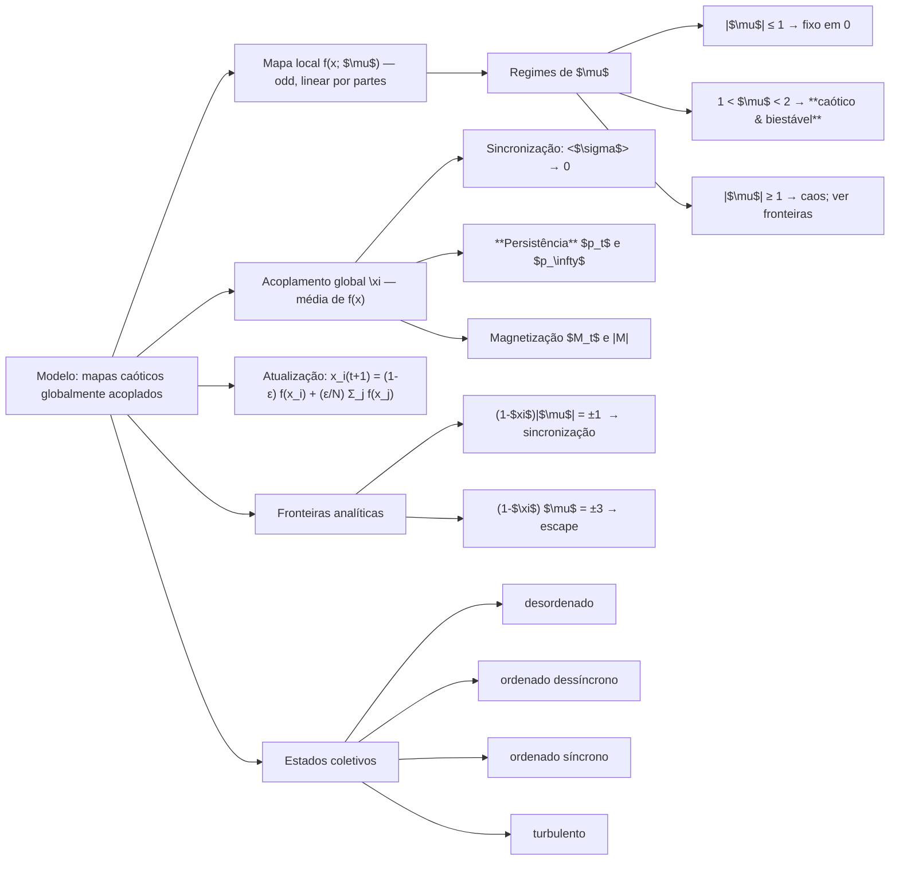

# Semana 1 — Fundamentos, Modelo e Verificação Rápida

> Base principal: Alvarez‑Llamoza & Cosenza (2014) — *Synchronization and phase ordering in globally coupled chaotic maps*. 
> Este .md é o **mapa mental + plano técnico** para implementar o núcleo do projeto e reproduzir as figuras‑chave.
> Artigo: [arxiv](https://arxiv.org/pdf/1402.4870)

---

## Mapa mental (visão geral)

---

## Modelo matemático

### Atualização com acoplamento global

$$x_i^{t+1} = (1-\varepsilon)f(x_i^{t}) + \frac{\varepsilon}{N}\sum_{j=1}^{N} f(x_j^{t}),\quad i=1\dots N$$

* $x_i^t \in [-1,1]$, $\varepsilon$ é o acoplamento; o termo da soma é o **campo médio** de f. 
 
O que é o mapa global: Como podemos ver cada $x_i$ em $t+1$ depende de todos os outros $x^t$. Podemos interpretar isso
como um mapa que está todo conectado e que todas apartícuals influênciam umas as outras, ou seja, um acoplamento global.
Geralmente tratamos de casos locais: Só os primeiros vizinhos influenciam o próximo passo. Nesse caso estamos fazendo justamente
o contrário, todo mundo influencia todo mundo.

### Mapa local (odd, linear por partes)

$$f(x;\mu) =
\begin{cases}
-\tfrac{2\mu}{3} - \mu x & x\in[-1,-\tfrac{1}{3}]\\
\mu x & x\in[-\tfrac{1}{3}\tfrac{1}{3}]\\
\tfrac{2\mu}{3} - \mu x & x\in[\tfrac{1}{3},1].
\end{cases}$$

* Parâmetro local: $\mu\in[-3,3]$.
* **Regiões:**

  * $(|\mu|\le 1)$: ponto fixo estável em 0.
  * $(1<\mu<2)$: **caótico e biestável**; dois atratores caóticos simétricos em
    $I_\pm = [\pm\mu(2-\mu)/3,, \pm\mu/3]$.
  * Em mapas lineares por partes, $|f'|=|\mu|$ em cada ramo ⇒ **Lyapunov local** $\lambda=\ln|\mu|$ (quando em regime caótico).

### Fronteiras analíticas (sincronização e escape)

* Da análise linear em torno do estado sincronizado:
  $$(1-\varepsilon)e^{\lambda} = \pm 1 \Rightarrow (1-\varepsilon)|\mu| = \pm 1$$

  * Para $\mu=1.9$: $\varepsilon_{\text{sync,inf}} \approx 0.473$, $\varepsilon_{\text{sync,sup}} \approx 1.526$.
* **Escape** do intervalo [-1,1]:
  $$(1-\varepsilon)\mu = \pm 3.$$

---

## Quantidades coletivas (observáveis)

* **Desvio‑padrão instantâneo**:
  $\sigma_t = \big[\tfrac{1}{N}\sum_i (x_i^t - \bar x_t)^2\big]^{1/2}$, $\bar x_t = \tfrac{1}{N}\sum_i x_i^t$.
  **Critério de sincronização**: $\langle\sigma\rangle$ (média temporal assintótica) $\approx 0$ (No código com tolerância numérica pequena).
* **Spins**: $s_i^t = \operatorname{sign}(x_i^t)\in{-1,+1}$.
  **Persistência**: $p_t$ = fração de mapas cujo **sinal não mudou** desde t=0. O valor de saturação $p_\infty$ **depende de $\varepsilon$** e distingue realizações do estado ordenado.
* **Magnetização**: $M_t = \tfrac{1}{N}\sum_i s_i^t$; usamos $|\langle M\rangle|$ como parâmetro de ordem (assintótico, após descartar transientes).

**Cenários típicos $\mu \approx 1.9$:**

* $\varepsilon < \varepsilon_1$: fase **não ordenada**, $|\langle M\rangle|=0$, $p_\infty=1$ (spins congelam nas bacias iniciais).
* $\varepsilon_1 < \varepsilon < 1$: **ordenado dessíncrono**, $|\langle M\rangle|=1$, $\langle\sigma\rangle>0$, $p_\infty\approx 0.5$.
* $1 < \varepsilon < \varepsilon_{\text{sync,sup}}$: **ordenado síncrono**, $|\langle M\rangle|=1$, $\langle\sigma\rangle\approx 0$, $p_\infty\approx 0.5$.
* $\varepsilon > 1$: transição descontínua p/ **turbulento** (no artigo, marca‑se um salto adicional e $|\langle M\rangle|\to 0$ em faixa).

> Observação: valores críticos exatos dependem de $\mu$; usaremos $\mu=1.9$ para reproduzir as figuras do artigo.

---

## Plano de reprodução (Semana 1)

**Alvo imediato:** reconstituir as **fronteiras de sincronização e de escape** (Fig. 1), validar $\langle\sigma\rangle$ e preparar o terreno para **persistência** e **magnetização** (Semanas 2–3).

Parâmetros padrão p/ testes rápidos:

* $N\in[10^3,10^4]$ (computacionalmente leve; o paper usou $10^5$).
* $\mu=1.9$; $\varepsilon$ em malha fina englobando as fronteiras analíticas.
* **ICs (bistáveis)**: metade dos mapas com amostras uniformes em $I_+$, metade em $I_-$, com sinais misturados aleatoriamente.
* Transientes: descartar $T_{\text{burn}}$ (e.g., 10^3–10^4), depois medir $\langle\sigma\rangle$.

---

## Organização do código (Semana 1)

### `gcm/maps.py`

**Objetivo:** encapsular o mapa local e utilidades analíticas.

* `bistable_map(x: np.ndarray, mu: float) -> np.ndarray`
  Aplica $f(x;\mu)$ **vetorizado** em `x`.

  * Regras por faixa: `x<=-1/3`, `|x|<1/3`, `x>=1/3`.
  * **Clipping** opcional para [-1,1] (desligado por padrão; só para depuração ao estudar escape).

* `bistable_intervals(mu: float) -> tuple[tuple[float,float], tuple[float,float]]`
  Retorna $(I_-, I_+)$ com $I_\pm = [\pm\mu(2-\mu)/3,, \pm\mu/3]$.

* `lyapunov_local(mu: float) -> float`
  Retorna $\lambda = \ln|\mu|$ (em regime caótico linear por partes). Útil para as fronteiras analíticas.

* `sync_boundaries(mu: float) -> tuple[float,float]`
  Calcula $\varepsilon_{\text{sync,inf}} = 1 - 1/|\mu|$ e $\varepsilon_{\text{sync,sup}} = 1 + 1/|\mu|$.

* `escape_boundaries(mu: float) -> tuple[float,float]`
  Calcula $\varepsilon$ tais que $(1-\varepsilon)\mu=\pm3$ (cuidar de sinais e $\mu=0$).

**Retornos e contratos:**

* Todas as funções validam domínio de $\mu$ e lançam `ValueError` com mensagem clara quando for o caso.

---

### `gcm/core.py`

**Objetivo:** motor de evolução do sistema globalmente acoplado.

* `@dataclass Config(N:int, eps:float, mu:float, seed:int|None=None)`
  Imutável (frozen) para facilitar reprodutibilidade.

* `class GloballyCoupledMaps`

  * `__init__(cfg: Config)`: inicializa RNG, estado `x` (vazio; ver `reset`).
  * `reset(init: str="half_half", rng=None) -> None`: cria ICs.

    * `half_half`: amostra uniformemente em $I_\pm$; randomiza quais índices recebem $I_+$ vs $I_-$.
    * `uniform`: amostra uniforme em [-1,1] (opção de depuração).
  * `step() -> None`:

    1. `y = f(x; mu)` (uma única chamada vetorizada).
    2. `mean_y = y.mean()`.
    3. `x = (1-eps)*y + eps*mean_y`.
    4. (opcional) marcar `escaped = |x|>1` para análise de escape (não clipe por padrão).
  * `run(T:int, discard:int=0, track: bool=False) -> np.ndarray | None`:

    * Executa `T` passos; se `track=True`, retorna trajetória `(T, N)` após descartar `discard`.
    * Caso contrário, retorna `None` (apenas atualiza estado e métricas on‑the‑fly).

**Retornos e contratos:**

* Lança `ValueError` se `eps` ou `mu` fora dos domínios úteis; garante `x.shape==(N,)`.

---

### `gcm/metrics.py`

**Objetivo:** métricas e estatísticas.

* `sigma(x: np.ndarray) -> float`
  Desvio‑padrão entre mapas no instante.

* `spins(x: np.ndarray) -> np.ndarray`
  $s_i = \operatorname{sign}(x_i)$ com `0` tratado como `+1` por convenção.

* `magnetization(x: np.ndarray) -> float`
  $M_t = \tfrac{1}{N}\sum_i s_i$.

* `order_param_M(series_M: np.ndarray) -> float`
  Retorna $|\langle M\rangle|$ (média temporal do módulo de `M_t`).

* `persistence_curve(spin_series: np.ndarray) -> np.ndarray`
  Dado `spin_series` com shape `(T, N)`, retorna vetor $p_t$ (fração que **nunca** mudou de sinal desde (t=0)). Implementação **streaming** (sem matrizes gigantes): mantém um booleano `changed` e atualiza cumulativamente.

* `sigma_mean(sigmas: np.ndarray) -> float`
  Agrega $\langle\sigma\rangle$ após descartar transiente.

---

### `gcm/analysis.py`

**Objetivo:** pipelines reprodutíveis e plots (Fig. 1 nesta semana).

* `scan_eps(mu: float, eps_grid: np.ndarray, N:int, ...) -> dict`
  Para cada $\varepsilon$, roda $T_{\text{burn}}$ + $T_{\text{meas}}$, acumula $\langle\sigma\rangle$ e flags de escape.

* `theory_boundaries(mu: float) -> dict`
  Retorna curvas teóricas para sobrepor (sincronização e escape).

* Funções auxiliares para salvar CSVs em `data/` **(será criada automaticamente na primeira gravação)** e gerar figuras em `figs/` (idem).

---

## Decisões numéricas e performance

* **N**: começar com 2–5×10^3 em Colab e escalar; custo por passo é $O(N)$.
* **Transientes**: o paper usa médias temporais longas; definiremos `burn_in` e `T_meas` parametrizáveis.
* **Precisão**: `float64` por padrão; tolerância de sincronização `tol_sync ≈ 1e-7`.
* **Seed**: sempre registrada na `Config`.

---

## Checklist de verificação rápida (Semana 1)

* [ ] `maps.py` implementado e coberto por testes simples de faixas e intervalos (I_\pm).
* [ ] `core.py` evolui e conserva o estado no domínio quando esperado; identifica escapes.
* [ ] `metrics.py` retorna $\sigma_t$, $M_t$ e $p_t$ consistentes em casos artificiais (sanidade).
* [ ] `analysis.py` plota fronteiras teóricas e valida numérico vs analítico.

---

## Próximos passos (Semana 1 — Subpartes 4.2 e 4.3)

1. **Implementar** `maps.py`, `core.py`, `metrics.py` com docstrings estilo NumPy e testes mínimos.
2. **Notebook** `notebooks/00_model_check.ipynb`: checagens $\langle\sigma\rangle$ e fronteiras.
3. **Tests**: `pytest -q` cobrindo casos base e uma mini‑varredura.
